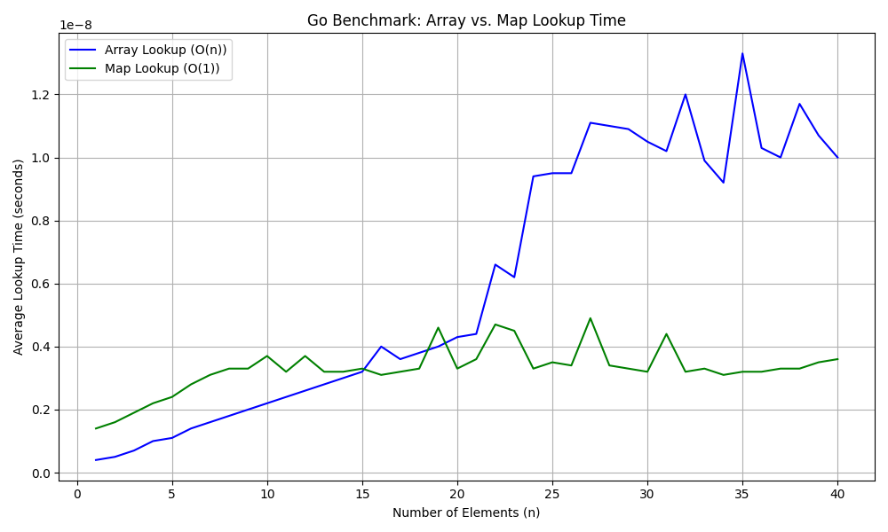

# Go Benchmark: Array vs. Map Lookup Time

This project provides a benchmark to compare the performance of array (slice) lookups versus map lookups in Go.

## Overview

The core of this project is a Go program that measures the time it takes to find an element in a slice versus a map for various data structure sizes.

- **Array/Slice Lookup:** In the worst-case scenario, finding an item in an array or slice requires scanning the entire collection, resulting in a time complexity of O(n).
- **Map Lookup:** Maps (or hash tables) are designed for fast lookups, with an average time complexity of O(1).

This benchmark demonstrates this fundamental difference in performance.

## How to Run

### Prerequisites

- Go (tested with version 1.24.3)
- Python 3
- Pandas and Matplotlib for Python (`pip install pandas matplotlib`)

### Steps

1.  **Run the Go Benchmark:**
    This will generate the `benchmark.csv` file containing the raw performance data.
    ```bash
    go run main.go
    ```

2.  **Generate the Plot:**
    This script reads the `benchmark.csv` file and creates a plot visualizing the results, saving it as `go_array_vs_map_lookup.png`.
    ```bash
    python main.py
    ```

## Results

The benchmark results clearly show that the lookup time for an array (slice) grows linearly with the number of elements (n), while the map lookup time remains relatively constant.



## Conclusion

This experiment confirms the theoretical time complexities of array and map lookups. For applications requiring frequent lookups in a large dataset, using a map is significantly more efficient than iterating over an array.
