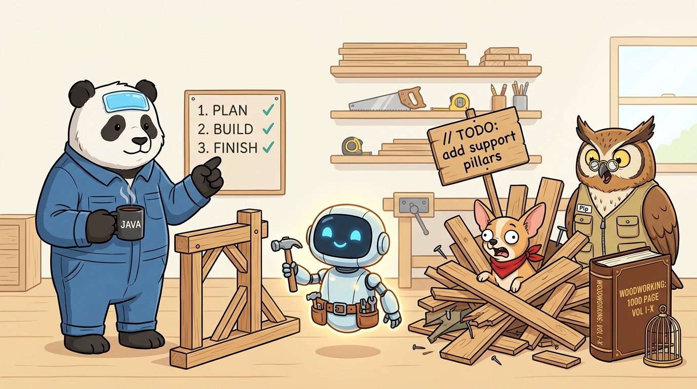

# Divide and Conquer in the AI Era

## 🪵 The Magic Carpenter's Apprentice

The woodworking shop receives a new **"Magic Mechanical Robot"**.

> 🤖 **Robot:** *"I can build anything. What do you want?"*

### 💥 The Chihuahua's 1-Shot Mega Prompt
🐕 **The Chihuahua rushes in:**
> *"Build me a house. SHIP IT NOW!"*

The robot spins like a tornado. Sawdust explodes everywhere. Five seconds later, a bizarre house appears—with a toilet on the roof, a wall made of cheese, and a wooden sign nailed to the front: `// TODO: add support pillars`.

*CRASH!* The entire house collapses immediately.

> 🐕 **The Chihuahua (screaming from under the rubble):** 
> *"Useless junk! AI is a scam! It hallucinated half the house!"*

---
### 📚 The Owl's Context Overflow
🦉 **The Owl steps up:**
> *"Your prompt was too simple and lacked architectural rigor."*

The Owl drops a 1,000-page leather-bound civil engineering treatise onto the robot:

> 🦉 *"Build me a house. Every enterprise blueprint and zoning regulation is in this book."*

The robot spends 3 days reading entire book. Then it spends another day building a tiny, over-complicated miniature birdcage.

> 🦉 **The Owl:** *"What's wrong with you?! I gave you all the context!"*
--- 

### 🐼 The Panda's Divide and Conquer
🐼 **The Panda sips black coffee quietly.**

The Panda pats the robot on the head and gives three small, sequential, verifiable commands:
1. > *"Pour four concrete foundation footings at each corner, 50 cm deep."*  
   → 🤖 **4 rock-solid footings poured.** *(Panda checks level: ✅)*
2. > *"Erect four vertical timber wall frames and secure them to the footings."*  
   → 🤖 **4 sturdy walls framed.** *(Panda checks joints: ✅)*
3. > *"Mount the pre-cut roof trusses on top and screw down the cedar shingles."*  
   → 🤖 **Roof securely mounted.** *(Panda checks waterproof seal: ✅)*

Before lunch, a flawless, weather-proof house is standing in the yard.

## 🪵 What is the Problem with AI?
1. **It cannot read your mind:** When you ask for a "big house" in one prompt, the LLM hallucinates assumptions to fill in the blanks (like cheese walls and roof toilets).
2. **Context degradation & truncation:** When given 100,000 tokens of vague requirements, the model loses attention, forgets intermediate constraints, and truncates output with `// TODO: implement later`.
3. **No intermediate feedback loop:** If you ask for 2,000 lines of code at once, you can't run tests until it fails. Small tasks allow instant compilation checks after every step.

## 🧩 Summary
Instead of asking AI to *"Build me a house"*, divide it into 3 small, typed steps, and populate it.