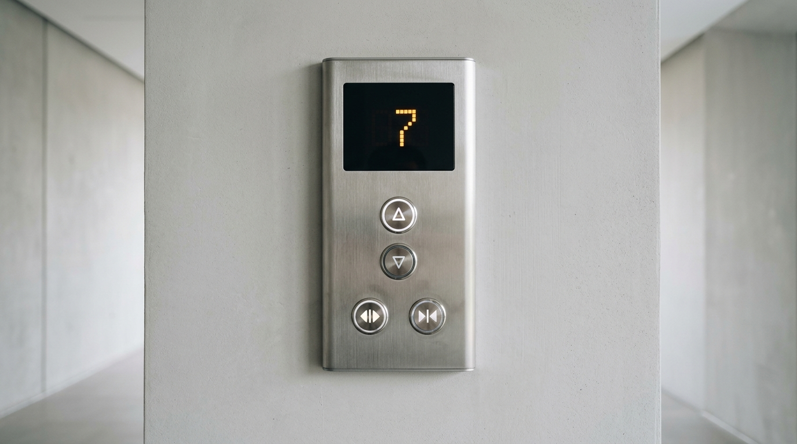

# Idempotency

## 🛗 The Elevator Panel Design

🐼 **The Panda** wants to install an elevator in the animal office tower and hires a designer.

🐕 **The Chihuahua** rushes over:
> *"Elevator is just for going up and down. Simple! Look at this minimal panel!"*



🐼 **The Panda** looks at the panel and nods: *"Looks clean."*

---

### 🐔 Day 1: The Solo Rider

* 🐔 **The Chicken** enters on the **1st floor** and wants to go to the **4th floor**.
* It presses the **`▲ UP`** button **3 times** ($1 + 3 = 4$).
* The elevator reaches the **4th floor**.  
* ✅ *It works as expected!*

---

### 💥 Day 2: The Double Trouble Incident

* 🐔 **The Chicken** enters on the **1st floor** (heading to the 4th floor) and presses **`▲ UP`** **3 times**.
* At the **2nd floor**, 🐱 **The Cat** enters. The Cat also wants to go to the **4th floor**, so it presses **`▲ UP`** **2 times**.
* The elevator adds the clicks ($4 + 2 = 6$) and shoots all the way up to the **6th floor**!

> 🐔 **The Chicken:** *"I wanted the 4th floor!"*  
> 🐱 **The Cat:** *"I also wanted the 4th floor! Why are we on the roof?!"*  
> 🐕 **The Chihuahua:** *"The hardware is fine! You guys clicked too much!"*  

---

## 🪵 What is the Problem?

The Chihuahua's panel is **non-idempotent**: each button press adds a **relative delta** (`floor = floor + 1`), causing side effects to accumulate with every click.

### 📐 Definition of Idempotency

> **An operation is idempotent if executing it multiple times produces the exact same result (and system state) as executing it once.**
>
> $$\Large f(f(x)) = f(x)$$

---

## 💻 Relative Deltas vs. Target State

### ❌ Non-Idempotent (Danger of Retries & Duplicates)
```sql
-- 💥 Dangerous: 3 network retries move the elevator 3 floors higher!
UPDATE elevator SET next_floor = next_floor + 1;
```

### ✅ Idempotent (Safe to Retry Anytime)
```sql
-- 🛡️ Safe: Running this 1 time or 100 times keeps target at floor 4
UPDATE elevator SET next_floor = 4;
```

---
