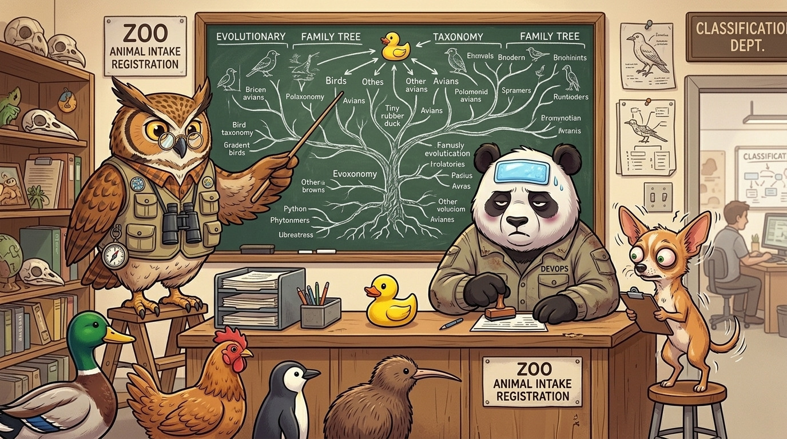
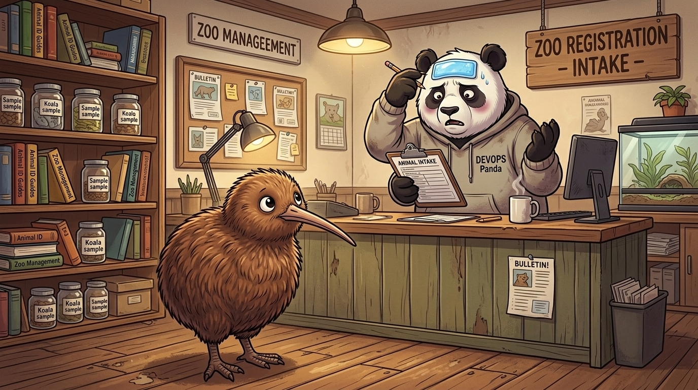

# Inheritance vs. Composition



## 🦆 The Grand Zoo Taxonomy

The 🐼Panda is put in charge of the city zoo's animal registry.

🦆 **Duck** & 🐔 **Chicken** arrive. They both have `wings` and can `fly`.

> 🐼 **Panda:** *"Create a `Bird` class (`wings`, `fly`). Perfect!"*

🐧 **Penguin** arrives. It has `wings`, but **can't fly**.

> 🐼 **Panda:** *"Create a `NoFlyBird` class to classify it."*

🥝 **Kiwi** arrives. It has `legs`, but **no wings**.



> 🐼 **Panda:** *"Is it not a `Bird`? I am confused."*

🐤 **Rubber Duck** arrives...

## 🪵 What is the Problem with Inheritance?

We try to find common traits and package them into a base `Bird` class.

However, **we can never predict what arrives next**—and every new animal threatens our neat hierarchy.

When that happens, we get trapped in a loop:
- Refactor the `Bird` class.
- Break it into pieces (`FlyingBird`, `NoFlyBird`).
- Regroup, rename, and rewrite again and again.

And naming those abstract classes? We waste hours debating taxonomy instead of shipping code.

```python
# Step 1: Duck & Chicken arrive
class Bird:
    def fly(self): pass

# Step 2: Penguin arrives (can't fly!) -> Split the class!
class FlyingBird(Bird):
    def fly(self): pass

class NoFlyBird(Bird):
    pass

# Step 3: Kiwi arrives (no wings!) -> Split again!
class WingedBird(Bird): pass
class WinglessBird(Bird): pass

# Step 4: Rubber Duck arrives (plastic toy!) -> 💥 Total collapse!
# Does RubberDuck inherit from Bird? Toy? PlasticThing?
```

## 🧩 How Composition Solves This

Inheritance forces an **"is-a"** relationship, while composition is about **"has-a / can-do"**.

- For **Duck** and **Chicken**, we just give `Wings` and `Fly()`.
- For **Penguin**, we only give `Wings` and `Swim()`.
- For **Kiwi**, we only give `Legs`.
- For **Rubber Duck**, we only give `Float()`.

```go
// 1. Define independent capabilities
type Flyer interface{ Fly() }
type Swimmer interface{ Swim() }
type Walker interface{ Walk() }

// 2. Each animal just has what it can do — no hierarchy needed!
type Duck struct{}       // Implements Flyer, Swimmer, Walker
type Penguin struct{}    // Implements Swimmer, Walker
type Kiwi struct{}       // Implements Walker
type RubberDuck struct{} // Implements Swimmer (floats!)
```

> *"We don't care what they are, just what they can do or have."*
