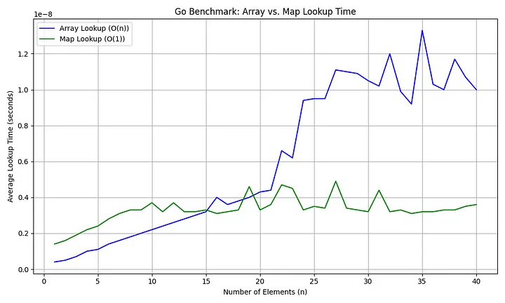

For small n < 40, array lookup can be faster than a map due to lower overhead.

Theoretical Complexity
Map (hash map): Average-case O(1) lookup time.
Array: O(n) for lookup by value, O(1) for lookup by index.
But in the real world, there has a lot of factors affect the result.

cache locality & miss
Hash overhead & collision
Access patterns
Implementation methods
… a lot
There are too many concepts to explain here, so I focus on some important topics that gives us more focus without benchmark

Access Patterns Matter
When you say “lookup index in array,” it depends on the pattern:

Download the Medium app
Best case (always lookup at index 0): O(1)
Average case (evenly random index): O(n/2)
Worst case (always at end): O(n)
Obviously, if you always look up the element at the small index, it will not slower than map

The n size
Because lists store elements contiguously in memory, it may be loaded once in a lookup, that is what the result looks like:

Press enter or click to view image in full size

I5–12600k ddr4–2666, WSL, lookup last element
Show you my code

So, How to decide it?
Here’s my rule of thumb if you can’t benchmark:

If n ≤ 40, use array
If lookup index is always < 20, use array
If n > 40, use map
A Note on Python
Python’s dict is highly optimized in C and often faster than a linear list search — especially for large datasets.