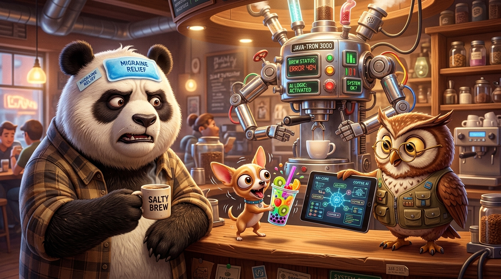

# Least Agent Principle



## ☕ The Autonomous Coffee Shop

**The Owl** builds a robot coffee shop powered by an autonomous AI agent swarm.

---

### ☀️ Day 1

🐼 **The Panda walks in:**
> *"Medium latte. No sugar. Whole milk."*

The robot whirs. The latte is perfect.

🐕 **The Chihuahua rushes in:**
> *"CAPPUCCINO! NO MILK! ADD BOBA! ADD SALT! SHIP IT NOW!"*

The AI adapts. The bizarre drink is made. The Chihuahua is thrilled.

---

### ☀️ Day 2

🐼 **The Panda orders:**
> *"Medium latte. No sugar. Whole milk."*

*Ding!* Perfect latte again.

🐕 **The Chihuahua orders:**
> *"DOUBLE ESPRESSO! ADD LEMON JUICE! ADD STRAWBERRY SYRUP!"*

The AI parses the mess. Another weird drink served.

🦉 **The Owl smiles:** *"Total autonomy. Pure perfection."*

---

### ⛈️ Day 3

🐼 **The Panda orders the exact same thing:**
> *"Medium latte. No sugar. Whole milk."*

The robot spins for 45 seconds. It drops the cup.

The Panda takes a sip. *SPIT!* It's loaded with salt.

> 🐼 **The Panda:** *"I order the same drink every day. Why is there salt in my latte?"*

> 🦉 **The Owl:** *"The Chihuahua's previous context drifted into our agentic memory mesh..."*

> 🐼 **The Panda:** *"I don't need an AI agent to make a latte. I need a `switch` statement."*


## 🪵 Why AI is Not Always the Answer

1. **Non-deterministic:** Same input, different output. You order a latte; you get salt.
2. **Black Box:** When code fails, you check line 42. When AI fails, you debug a 5,000-token prompt.
3. **High Latency & Cost:** A `switch` takes 5 nanoseconds ($0.00). An agent loop takes 3 seconds ($0.03).
4. **Context Drift:** Long prompts make models forget negative rules (*"no salt"*).
5. **Compounding Failure:** 4 agents at 95% accuracy = only 81% total success ($0.95^4$).

---

## 🚫 Which Flows Should Avoid AI?

- **Deterministic Logic:** Fixed recipes, standard CRUD, order lookups.
- **Math & Finance:** LLMs predict words, not numbers.
- **Auth & Safety:** Prompt injection can bypass AI rules.
- **Structured Data:** Use `json.Unmarshal`, not an LLM.
- **High-Frequency Tasks:** Pure waste of latency for repeated inputs.

---

## ✨ Where AI Actually Shines

- **Fuzzy Intent Translation:** Turning the Chihuahua's chaos into strict JSON.
- **Semantic Search:** Matching vague descriptions (*"bitter morning wake-up drink"*).
- **Open-Ended Tasks:** Creative suggestions, summarization, and diagnostics.

---

## 📐 The Hierarchy of Least Agency

```
Level 1: Deterministic Code / Lookup Table  (0 tokens, nanoseconds, 100% reliable)  <-- Panda's Latte
Level 2: Fixed Pipeline / State Machine     (Predictable, auditable steps)
Level 3: Single LLM + Structured Schema     (Fuzzy input -> strict JSON)            <-- Chihuahua's Order
Level 4: Autonomous Multi-Agent Swarm       (Open-ended exploration only)
```

> **The Panda's Rule:**  
> *"Always use the lowest level of agency possible. Use AI to parse the Chihuahua's chaos. Use plain code to brew the Panda's coffee."*