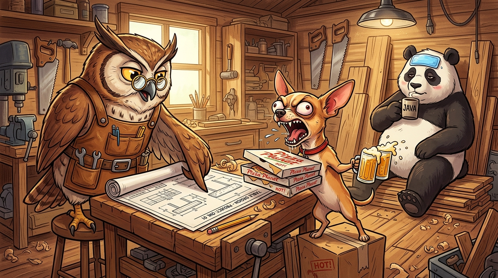

# Return Structs, Not Interfaces



## 🏭 The Owl's Factory

*DiDong!* The Panda walks into the Owl's factory.

> *"I need something to put my laptop and coffee."*

The Owl builds a sturdy table with a flat top:
> *"Here you go! This is a Table interface. You can use it to put your laptop and coffee!"*

The Chihuahua rushes in:
> *"Hey! I need a table to hold pizzas and beers, today is my birthday! I want to throw a party!"*

The Chihuahua spots the table sitting in the corner:
> *"That table seems perfect! Give me the same table!"*

The Owl takes out the blueprints:
> *"No, it was designed for a laptop and coffee. Not for pizzas and beers."*

The Chihuahua barks in rage:
> *"Idiot! It is a table, what difference does it make? I want the same table, NOW!"*

---

## 🪵 What is the Problem?

A table with a flat top can be used for many things—there is no need to restrict its usage!

```go
// The Panda wants
type WorkTable interface {
    PutCoffee()
    PutLaptop()
}

func StartWorking(w WorkTable) {
    w.PutLaptop()
    w.PutCoffee()
}

// The Chihuahua wants
type PartyTable interface {
    PutPizzas()
    PutBeers()
}

func HostParty(p PartyTable) {
    p.PutPizzas()
    p.PutBeers()
}

// The Owl's design ❌ (WRONG)
func NewWorkTable() WorkTable   {}
func NewPartyTable() PartyTable {}

// The flexible solution ✅
type Table struct{}

func NewTable() Table           {}
func (t Table) PutCoffee()      {}
func (t Table) PutLaptop()      {}
func (t Table) PutPizzas()      {}
func (t Table) PutBeers()       {}

func main() {
    table := NewTable()
    StartWorking(table) // ✅ Works!
    HostParty(table)    // ✅ Also works!
}
```

---

> *"Give them the table and stop trying to predict their business."*