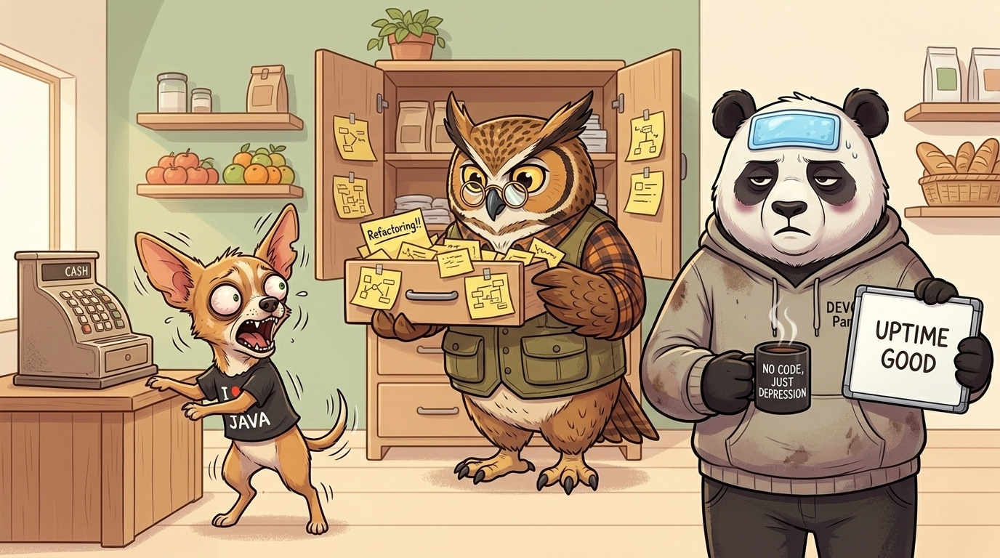

# Stack vs Heap

## 🗄️ The Grocery Store Inventory

Every morning at the animal supermarket, we need to count our merchandise and record the daily inventory.

🦉 **The Owl** (our Chief Architect) designs an enterprise filing system:
1. A massive oak cabinet with hundreds of wooden drawers—one drawer for every product.
2. Every morning, the checkers count the items, write the numbers on paper **sticky notes**, and file them into the drawers.
3. 🐼 **The Panda** checks the notes to calculate what needs to be restocked.
4. Throughout the day, the Owl patrols the aisles to inspect drawers and throw away expired sticky notes.

---
### 💥 The System Breaks Down
1. **Massive Overhead (Malloc):** Checkers spend half their morning unpeeling, sticking, and filing thousands of tiny paper notes.
2. **Exhausting Audits (Gc):** Because the Owl doesn't know which drawer contains expired notes, it has to open and scan every single drawer in the building.
3. **Storewide Panic (Stop-The-World Pause):** While the Owl audits the drawers, it blows a whistle and halts all cash registers. 🐕 **The Chihuahua** vibrates in pure rage as checkout lines back up out the front door:
   > *"Why are the registers frozen?! Customers are rioting at counter 3!"*  
   > 🦉 **The Owl:** *"Patience! The inventory cleanup must maintain strict consistency!"*
---

### 🐼 The Panda's Simple Solution
I finish my coffee, walk over to the drawers, and remove the sticky notes.
1. **Fixed-Size Whiteboards (The Stack):** In each drawer, I mount a small, fixed-size dry-erase whiteboard.
2. **In-Place Updates (Zero GC):** When checkers count inventory, they simply overwrite yesterday's numbers. 
3. **Instant Reset:** No paper is bought (`no malloc`), no expired notes accumulate (`no GC`), and the store never stops serving customers (`no STW`).

## ⚖️ The Breakdown: Stack vs. Heap

### 🪵 1. Allocation Cost
* **The Whiteboard (Stack):** Instant. Moving the stack pointer (`SP`) takes a single CPU instruction.
* **The Sticky Note (Heap):** Expensive. Must call the memory allocator (`mallocgc`), find free size classes, and synchronize memory spans.

### ⏳ 2. Lifetime & Scope
* **The Whiteboard (Stack):** Strictly scoped to the function. When the function returns, the entire stack frame is wiped automatically.
* **The Sticky Note (Heap):** Dynamic and unpredictable. Lives as long as someone, somewhere, holds a reference pointer to it.

### 🧹 3. Cleanup & Garbage Collection
* **The Whiteboard (Stack):** **Zero cost.** No Garbage Collector tracking, no background scans, zero Stop-The-World (STW) pauses.
* **The Sticky Note (Heap):** **High overhead.** The GC must periodically traverse and mark reachable objects, pausing execution during high memory pressure.

### ⚡ 4. CPU Cache & Speed
* **The Whiteboard (Stack):** Blazing fast. Stack memory is compact and contiguous, staying hot in CPU L1/L2 caches.
* **The Sticky Note (Heap):** Slower. Scattered across RAM, incurring pointer-chasing latency and frequent cache misses.

---

## ❓ Why Do We Still Need the Heap?

If the whiteboard (Stack) is so fast and GC-free, why not use it for everything?

1. **Unknown / Dynamic Size at Compile Time**  
   If a shipment arrives with an unpredictable number of items, a fixed-size whiteboard cannot fit it. Dynamic slices (`make([]Item, n)`) and growing buffers must live on the heap.

2. **Data That Outlives the Function Scope (Shared State)**  
   When the checker leaves the room (function returns), the whiteboard is wiped clean. If data needs to be shared across multiple workers (goroutines) or persist for the lifetime of the application, it must live in the heap.

3. **Size Limitations (Avoiding Stack Overflow)**  
   Goroutine stacks start tiny (~2 KB) and grow incrementally. Storing a 50 MB payload on the stack would blow the stack budget and trigger expensive stack reallocations.

4. **Developer Productivity & Memory Safety (GC Saves Massive Dev Time)**  
   Without automatic Garbage Collection on the heap, developers would be forced to manually track lifetimes with `free()`. A single mistake leads to insidious memory leaks, dangling pointers, or `use-after-free` crashes. The GC trades a fraction of CPU overhead to eliminate entire categories of fatal memory bugs so developers can focus on shipping features.

---

> 🐼 **Panda's Rule:** *"Write on the whiteboard for daily scratchwork. Rent a warehouse only when the shipment is too large or outlives your shift."*
