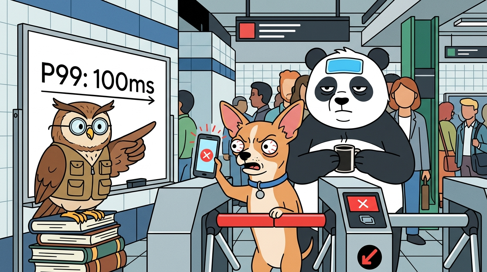

# The P99 Trap & Tail Latency Amplification

---

## 🚇 The 8:55 AM Rush Hour at Central Station

It is 8:55 AM on a manic Monday morning at Central Station. 

Thousands of commuter animals pour down the escalators. The 9:00 AM company standup is five minutes away.

At the fare gates, the contactless turnstiles sing in a rapid, satisfying rhythm:  
*Beep... Beep... Beep... Beep...*

🦉 **The Owl** perches atop the station ticket machine in gold wire-rimmed spectacles, proudly monitoring its digital tablet:

> *"Behold the algorithmic elegance of our new fare gate system! The P99 scan latency across NFC cards and QR codes is strictly under 100 milliseconds. Pure architectural perfection."*

And for a while, the numbers hold up:
* 🐼 **The Panda** taps a physical card: **`30 ms`** — *Beep!*
* 🐰 **The Rabbit** taps a smart watch: **`10 ms`** — *Beep!*
* 🐕 **The Dog** taps phone NFC: **`65 ms`** — *Beep!*
* 🐕 **The Chihuahua** is unlucky and hits the 1% tail: **`10,000 ms (10s)`** — *Spinning...*

---

### 💥 The 1% Tail Latency Hits

The gate hits its inherent 1% tail spike—a backend sync retry and cold cache miss. 

The screen freezes, the barrier arm locks, and the turnstile stalls for **10 full seconds**.

---

### 🛑 The Line Behind Collapses (Head-of-Line Blocking)

Behind the Chihuahua in Lane 3, a line of 20 hurried commuters is trapped inside the narrow metal guardrails. 

* 🐱 The Cat with a valid card cannot pass.
* 🦥 The Sloth with an exact-change token cannot pass.
* 🐼 The Panda with a steaming coffee mug is stuck in place.

Meanwhile, adjacent lanes breeze by smoothly.

> 🐕 **The Chihuahua:** *"WHY IS THIS GATE HOLDING ME HOSTAGE?!"*  
> 🦉 **The Owl:** *"Statistically, 99% of scans are under 100ms. The 1% tail is within formal SLA."*  
> 🐼 **The Panda:** *"You measured taps in a vacuum. In a queue, tail latency is contagious."*

---

## 🪵 What is the Problem?

The Owl measures **P99 in isolation**. But in real-world systems, requests are rarely independent.

Tail latency amplifies in two deadly ways:

### 1. 🚶 Head-of-Line Blocking (Queue Contagion)
In any FIFO queue (turnstile lanes, worker pools, database connections), **latency is contagious**:
* 🐕 Chihuahua stalls for **10s**.
* 🐱 Everyone queued behind him is forced to wait **10s**, even if their own tap takes only 10ms.

---

### 2. 👥 Fan-Out Amplification (Group Dependency)
When a request depends on $N$ parallel sub-tasks (a group boarding together, or an API calling 50 microservices), the total latency is decided by the **slowest link**:

$$\Large P(\text{Delayed}) = 1 - (0.99)^N$$

* **1 call:** $1\%$ chance of delay
* **10 calls:** $9.6\%$ chance of delay (~1 in 10)
* **50 calls:** **$39.5\%$ chance of delay** (~4 in 10)
* **100 calls:** **$63.4\%$ chance of delay** (~2 in 3)

> 🐼 **The SRE Paradox:** Every backend team shows a **100% green dashboard** (<100ms P99), while **over 60% of real users** experience painful latency!

---

## 🐼 Panda's Takeaways

1. **Tail latency is contagious:** In a queue, one slow request becomes the base delay for everyone behind it.
2. **Fan-out amplifies the tail:** More dependencies mean you experience the worst-case tail, not the average.
3. **Fail fast with timeouts:** If an operation exceeds its budget, timeout and route around it. Never let one stuck request block the pipeline.

> *"A 99% SLA looks great on the slide deck. But when the train doors close, nobody cares about your average."*
